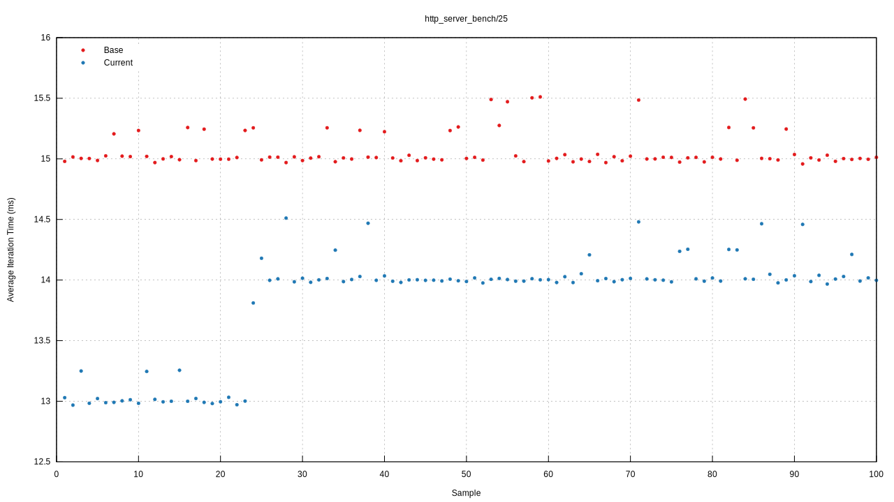
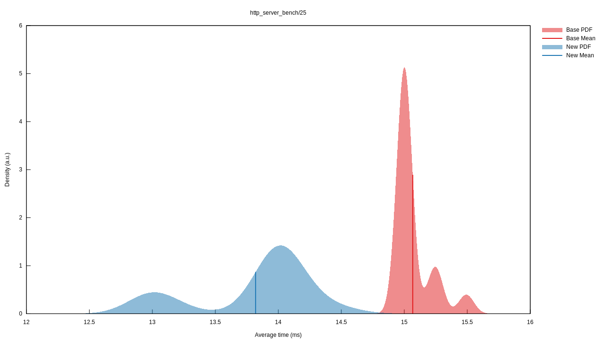

# IO_URING vs Epoll Benchmarks

Below you can find benchmarks run on:
* Intel(R) Xeon(R) W-2295 CPU @ 3.00GHz with single NUMA node over 18 cores.
* 200 GB RAM
* Governor disabled.
* Frequency scaling disabled.
* intel pstate turbo disabled.

## HTTP 1.1 Server Benchmarks
All benches are using `streaming` mode of io_uring when `multishot` style completion is enabled, ~10% throughput increase is expected.
Proof:
```text
http_server_bench/25    time:   [13.729 ms 13.820 ms 13.905 ms]                                 
                        thrpt:  [19.867 MiB/s 19.990 MiB/s 20.122 MiB/s]
                 change:
                        time:   [-8.8720% -8.2800% -7.6595%] (p = 0.00 < 0.05)
                        thrpt:  [+8.2948% +9.0275% +9.7358%]
                        Performance has improved.
```

### 25 concurrent users with 12KB body response

### Epoll

Iteration times of Epoll


Probability Distribution Function of Epoll


### Uring

Iteration times of IO_URING


Probability Distribution Function of IO_URING


### Uring with Multishot

Iteration times of IO_URING multishot vs streaming mode


Probability Distribution Function of IO_URING multishot vs streaming mode



> If you want to have full HTTP 1.1 Server benchmark results, [here you can have the full report.](https://raw.githubusercontent.com/vertexclique/nuclei/master/docs/assets/benchres/io_uring_multishot_http_bench/nuclei_http_server_io_uring_multishot_bench_report.pdf)