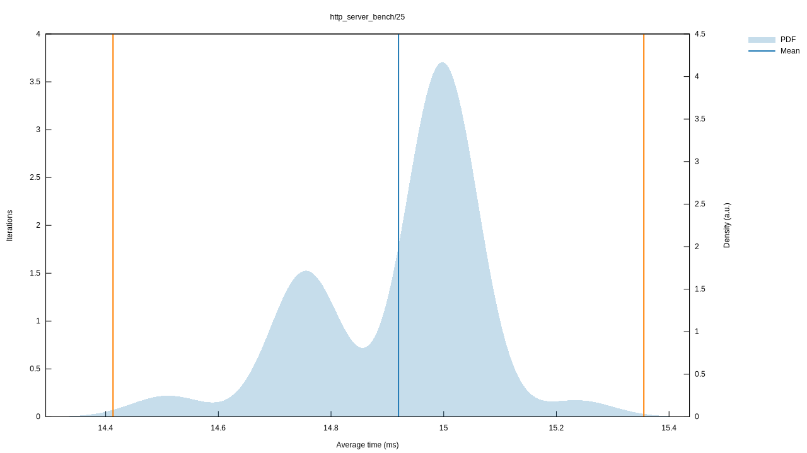
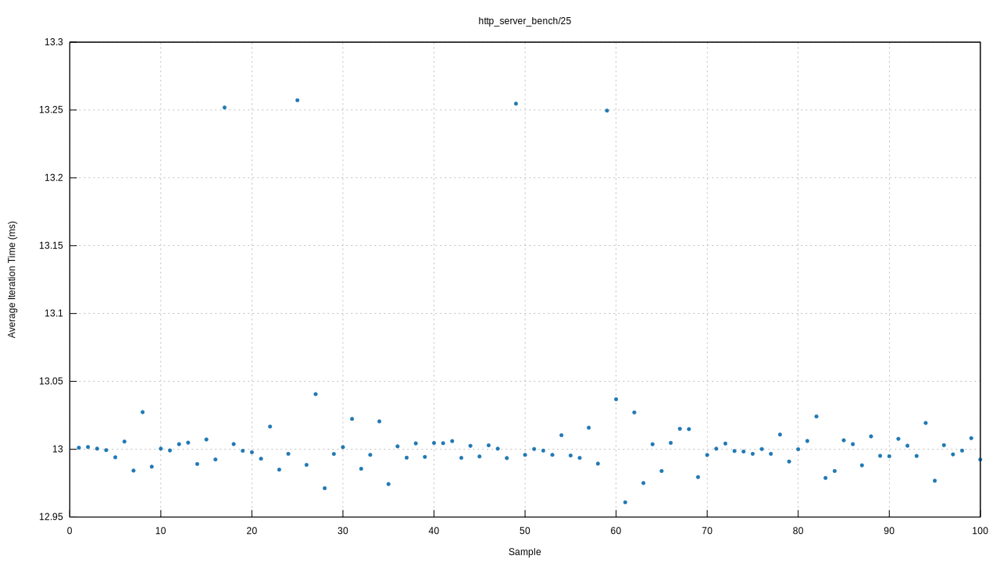
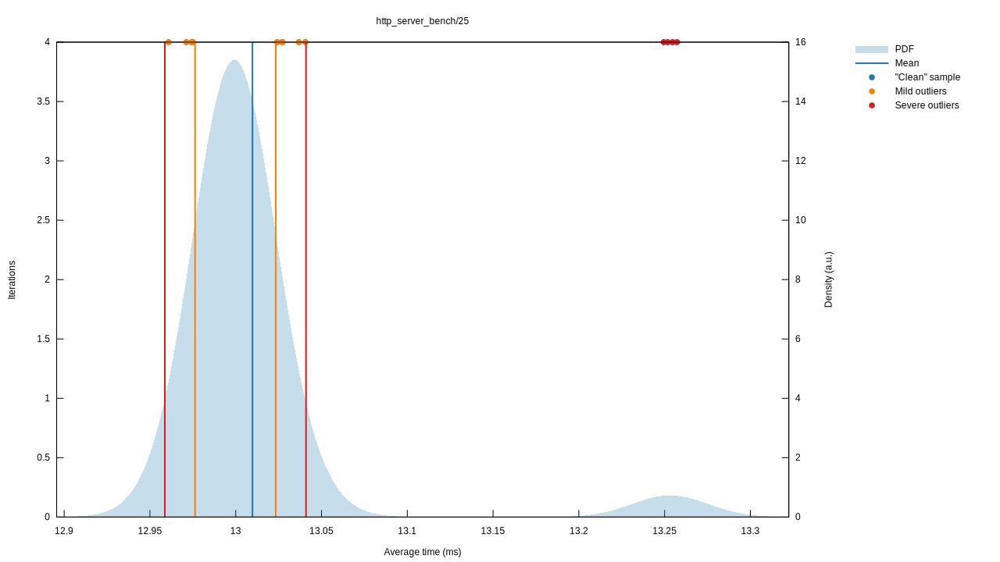

# IO_URING vs Epoll Benchmarks

Below you can find benchmarks run on:
* Intel(R) Xeon(R) W-2295 CPU @ 3.00GHz with single NUMA node over 18 cores.
* 200 GB RAM
* Governor disabled.
* Frequency scaling disabled.
* intel pstate turbo disabled.

## HTTP 1.1 Server Benchmarks

### 25 concurrent users with huge body response

### Epoll

Iteration times of Epoll

Probability Distribution Function of Epoll

### Uring

Iteration times of IO_URING

Probability Distribution Function of IO_URING

