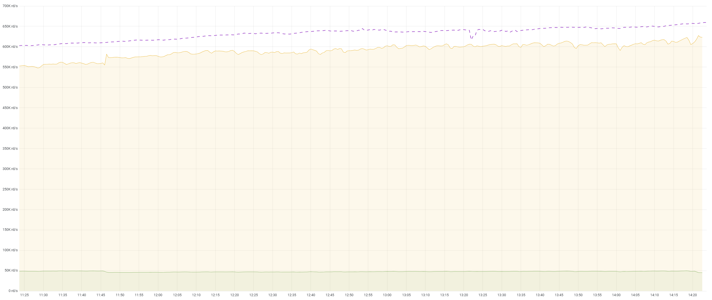

# Nuclei

Nuclei is a [proactor-based](http://citeseerx.ist.psu.edu/viewdoc/summary?doi=10.1.1.49.9183) IO system which is runtime agnostic and can work with any runtime.
The proactor system's design principles are matching [Boost Asio](https://www.boost.org/doc/libs/1_47_0/doc/html/boost_asio/overview/core/async.html).
Nuclei is not using a conventional reactor approach. It is completely asynchronous, and it's wrapping poll based IO in a proactive fashion.

Nuclei uses [io_uring](https://kernel.dk/io_uring.pdf) on Linux as the primary IO backend, secondarily you can use [epoll](https://en.wikipedia.org/wiki/Epoll). On MacOS, Nuclei is using [kqueue](https://en.wikipedia.org/wiki/Kqueue).
On Windows, the [IOCP](https://en.wikipedia.org/wiki/Input/output_completion_port) backend [will be used](https://github.com/vertexclique/nuclei/pull/3).

Current io_uring implementation needs Linux kernel 5.11+.

## Features

* Async TCP, UDP, Unix domain sockets and files…
* Proactor system don’t block.
* Scatter/Gather operations
* Minimal allocation as much as possible.
* More expressive than any other runtime.
* Completely asynchronous I/O system with lock free programming.

## What is the difference between this and other runtime X?

* Nuclei is the first project that **integrated io_uring and made available to others via proactive** approach.
  * It works with **demuxing IO requests with Proactive IO** approach.
* It is the **only proactive IO system**, it doesn't bundle its own runtime.
* You can **use any executor** with Nuclei.
  * You can also add features of executors to Nuclei if needed, but most probably it is supported out-of-the-box.
* Uses standardized [**non-sticky Async traits**](https://docs.rs/futures/latest/futures/io/index.html) that won't latch you to any executor.
  * But if you have stockholm syndrome, you can still use them with Nuclei without any problems.
* Performance optimized for heavy workloads and running under these heavy workloads already in various tech companies.
  * Example request distribution where nuclei runs: 

## Donations
* Consider supporting Nuclei development via GitHub sponsors:
  <iframe src="https://github.com/sponsors/vertexclique/card" title="Sponsor vertexclique" height="225" width="600" style="border: 0;"></iframe>